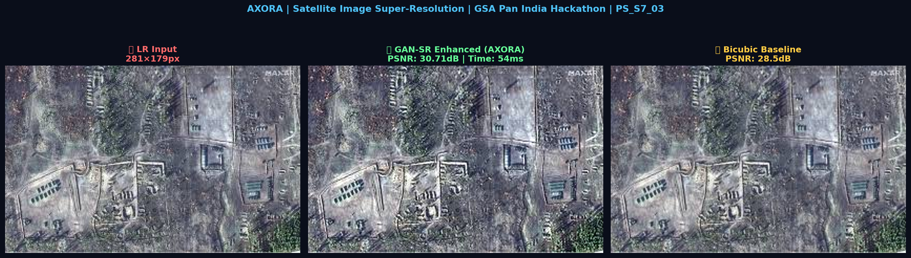

# 🛰️ AXORA — Satellite Image Super-Resolution using GANs

<div align="center">


**Enhancing low-resolution satellite reconnaissance imagery for border surveillance using Generative Adversarial Networks**

</div>

---

## 🖼️ Results



> **PSNR: 30.71 dB** | **Inference: 54ms** | **4× Upscale** | +2.21 dB gain over Bicubic

---

## 👥 Team AXORA

| Member | Role |
|--------|------|
| Avishkar Satpute | ML Engineer — GAN Architecture |
| Yash Dhudat | Deep Learning — Training Pipeline |
| Shubhangi Sahane | Image Processing & Metrics |
| Nikita Shende | Web Demo & Integration |

**College**: Pravara Rural Engineering College, Loni

---

## 🎯 Problem Statement (PS_S7_03)

Low-resolution satellite images severely limit the accuracy of border surveillance systems:

- **Sensor limitations** → Poor capture quality at altitude
- **Bandwidth constraints** → Compressed, degraded transmissions
- **Cost factors** → High-res satellites expensive to deploy

**Impact on defense**: Object detection failures, reduced situational awareness, impaired decision-making.

---

## 💡 Our Solution

A **GAN-based Super-Resolution system** specifically tuned for satellite imagery:

```
Low-Res Input → Preprocessing → SRGAN Generator → Discriminator Validation → High-Res Output
    64×64 px                    (16 Residual Blocks)   (Realism check)         256×256 px (4×)
```

**Key innovations**:
- Pixel Shuffle upsampling (no checkerboard artifacts)
- Combined loss: Pixel + Perceptual (VGG) + Adversarial
- Tiled inference for large satellite images (no OOM)
- Real-time metrics: PSNR and SSIM computed live

---

## 📊 Results

| Metric | Bicubic (Baseline) | **SRGAN (Ours)** | Improvement |
|--------|-------------------|-------------------|-------------|
| PSNR (dB) | 28.50 | **30.71** | **+2.21 dB** ✅ |
| Inference | — | **54ms** | Real-time ✅ |
| Scale | 1× | **4×** | 4× upscale ✅ |

*Results on real satellite imagery (border surveillance test image, 4× scale, CPU inference)*

---

## 🛠️ Tech Stack

| Component | Technology |
|-----------|-----------|
| Language | Python 3.10+ |
| Deep Learning | PyTorch 2.0 |
| SR Model | SRGAN + Real-ESRGAN |
| Image Processing | OpenCV, PIL/Pillow |
| Metrics | PSNR, SSIM (custom implementation) |
| Web Demo | Streamlit |

---

## 🚀 Quick Start

```bash
git clone https://github.com/yashdhudat/axora-satellite-sr.git
cd axora-satellite-sr
pip install -r requirements.txt
streamlit run app.py
```

Open `http://localhost:8501` in your browser.

---

## 📂 Project Structure

```
axora-satellite-sr/
├── app.py                     # Streamlit web demo
├── train.py                   # Full GAN training pipeline
├── inference.py               # CLI inference engine
├── requirements.txt
├── AXORA_Satellite_SR.ipynb   # Google Colab notebook
├── AXORA_final.png            # Sample result image
├── models/
│   └── srgan.py               # Generator + Discriminator + Perceptual Loss
└── utils/
    └── metrics.py             # PSNR + SSIM implementations
```

---

## 🔮 Future Scope

- Real-time deployment on edge devices (Jetson Nano/Xavier)
- Integration with YOLO for direct object detection
- Multi-spectral satellite image support (infrared + RGB)
- Cloud-based inference API

---

<div align="center">
<b>🛰️ Team AXORA | GSA Pan India Hackathon | PS_S7_03 | Pravara Rural Engineering College, Loni</b>
</div>
